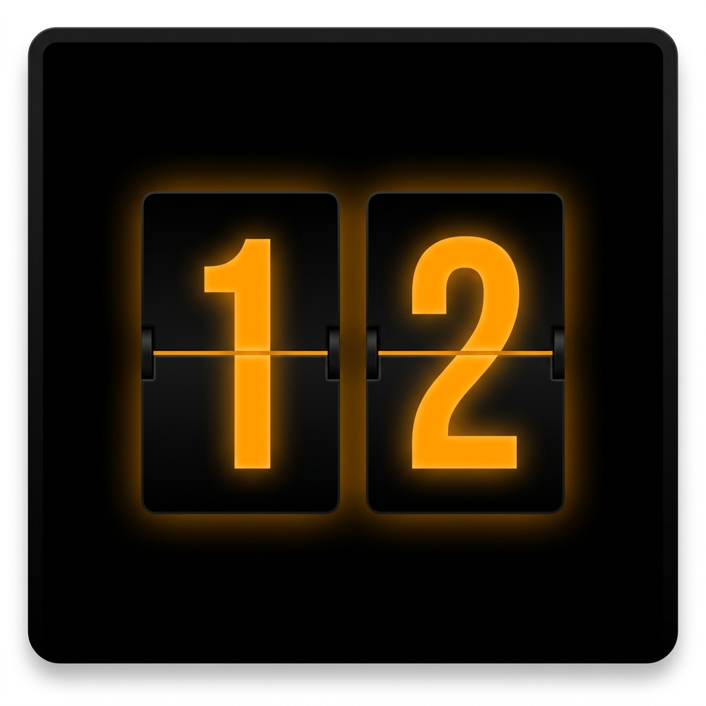

# FlipTime ⏱

> OLED-friendly flip digital clock & stopwatch PWA — built for Google Pixel

## Features

- 🕐 **Flip Clock** — real-time 12h/24h with glowing amber flip-card animation
- ⏱ **Flip Stopwatch** — count up with start/pause/reset
- 📱 **Fullscreen landscape immersive mode**
- 🖤 **Pure OLED black** (`#000000`) — near-zero battery on Pixel OLED screens
- 🔒 **Screen Wake Lock** — keeps display on while you work
- 🔄 **Pixel-shift burn-in protection** — shifts position every 5 min
- ☀️ **Software brightness slider** — dim without touching system brightness
- 📶 **100% Offline** — Service Worker caches all assets
- 📲 **Installable PWA** — Add to Home Screen on Android

## Install on your Pixel

1. Open Chrome on your Pixel and go to the hosted URL
2. Tap **⋮ → Add to Home screen**
3. It launches fullscreen like a native app — zero battery overhead

## Tech

Pure HTML5 / CSS3 / Vanilla JS — no frameworks, no dependencies, no network requests.
